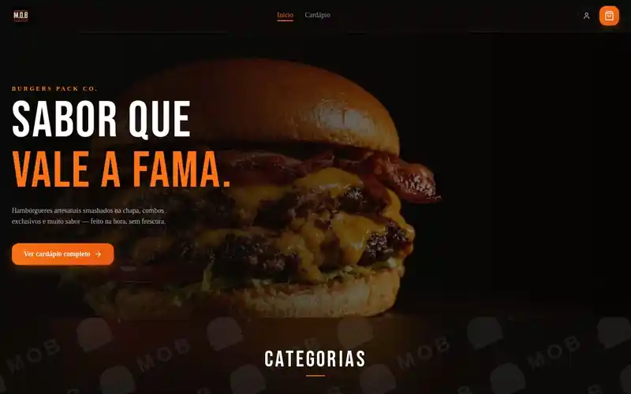

<div align="center">

<h1>🍔 M.O.B Burger — Web App</h1>

<p><strong>Plataforma de pedidos online e operação de cozinha para uma hamburgueria artesanal</strong></p>

<p>
  <a href="https://mob-burger-web.vercel.app" target="_blank">
    
  </a>
</p>

<p>
  
  
  
  
  
  
</p>



</div>

---

## O problema

Hamburguerias que vendem por iFood e Aiqfome entregam **até 30% do ticket em comissão** e não ficam com o que mais importa: o cadastro do cliente, o histórico de pedidos e o canal de contato. Quem constrói a audiência é o marketplace, não a marca.

## A solução

Um canal de vendas próprio, ponta a ponta — o cliente monta o pedido, paga na entrega e acompanha em tempo real; a cozinha recebe no painel no mesmo instante, sem intermediário e sem comissão. O produto está **em produção**, atendendo uma hamburgueria real em Lavras/MG.

São dois produtos no mesmo app:

| | Para quem | O que faz |
|---|---|---|
| **Loja** | Cliente final | Cardápio com busca e filtros, carrinho, cupons, checkout e rastreamento do pedido ao vivo |
| **Painel** | Operação da cozinha | Pedidos em tempo real, estoque, cardápio, entregadores, cupons e financeiro |

---

## ✨ Destaques de engenharia

**Tempo real sem WebSocket.** O acompanhamento do pedido e a fila da cozinha usam **Server-Sent Events**, com reconexão automática a cada 5s. SSE é unidirecional — exatamente a forma do problema (servidor → cliente) — e atravessa proxy HTTP sem handshake especial, enquanto um WebSocket aqui só adicionaria infra para manter.

**Um BFF que esconde a API.** Rotas de proxy (`/api/backend/[...path]`, `/api/auth/[...path]`) repassam `Authorization` e `Content-Type` para o backend, com rotas dedicadas para os streams SSE. O browser nunca fala direto com a API: a URL do backend não vai para o bundle e o CORS deixa de existir como problema.

**Estoque que fecha o cardápio sozinho.** Cada produto tem ficha técnica de ingredientes; confirmar um pedido desconta o estoque e recalcula a disponibilidade, tirando o item do ar antes que alguém peça o que a cozinha não tem.

**Push notifications nativas.** Web Push API + VAPID com service worker próprio (`public/sw.js`): a cozinha é avisada de pedido novo mesmo com o painel fechado, e o cliente sabe quando o pedido saiu para entrega.

**SEO para quem precisa ser achado.** `sitemap.ts` gerado dinamicamente e JSON-LD `Restaurant` no layout raiz — o negócio existe para o Google, não só para quem já tem o link.

**Estado onde ele pertence.** Zustand persistido em `localStorage` para carrinho, sessão e entrega (sobrevive ao refresh); TanStack Query para o que é do servidor. Cache de servidor e estado de UI não se misturam.

---

## 🛠️ Stack

<table>
  <tbody>
    <tr>
      <td><strong>Framework</strong></td>
      <td> (App Router)  </td>
    </tr>
    <tr>
      <td><strong>UI</strong></td>
      <td>   </td>
    </tr>
    <tr>
      <td><strong>Estado</strong></td>
      <td> (persist) </td>
    </tr>
    <tr>
      <td><strong>Formulários</strong></td>
      <td> </td>
    </tr>
    <tr>
      <td><strong>Tempo real</strong></td>
      <td> </td>
    </tr>
    <tr>
      <td><strong>Mídia</strong></td>
      <td> — upload de produtos, categorias e avatar</td>
    </tr>
    <tr>
      <td><strong>Interação</strong></td>
      <td>   </td>
    </tr>
    <tr>
      <td><strong>Auth</strong></td>
      <td> </td>
    </tr>
    <tr>
      <td><strong>Deploy</strong></td>
      <td> — auto-deploy a cada push em <code>main</code></td>
    </tr>
  </tbody>
</table>

---

## 🧭 O que dá para fazer

**Cliente**

- Cardápio com busca por nome ou ingrediente, filtro por categoria, faixa de preço e favoritos
- Produto com opções personalizáveis (rádio/checkbox) e observação por item
- Carrinho com cupom validado em tempo real, taxa por zona de entrega e endereço auto-preenchido por CEP (ViaCEP)
- Entrega ou retirada, com pagamento na entrega (dinheiro, cartão na maquininha ou PIX)
- Acompanhamento ao vivo com timeline de status, ETA, cancelamento e opt-in de push
- Perfil com avatar, endereço padrão, histórico e **refazer pedido** em um clique

**Operação**

- Fila de pedidos que se atualiza sozinha (SSE), troca de status, designação de entregador e impressão de comanda térmica
- Cardápio: CRUD de produtos e categorias, reordenação por drag-and-drop, toggle de disponibilidade
- Estoque: ingredientes, fichas técnicas, alerta de estoque baixo e histórico de movimentações
- Financeiro: receita diária, despesas por tipo, lucro bruto e exportação CSV
- Cupons (percentual, valor fixo, frete grátis), zonas de entrega, entregadores e equipe
- Configuração da loja: abrir/fechar, horários, WhatsApp e ocultar itens sem estoque

---

## 🚀 Rodando localmente

```bash
git clone https://github.com/mateus-vitor-ferreira-dev/mob-burger-web.git
cd mob-burger-web
npm install

cp .env.example .env.local   # veja as variáveis abaixo
npm run dev                  # http://localhost:3000
```

```ini
# .env.local
NEXT_PUBLIC_API_URL=http://localhost:3002
```

> Requer a **API do M.O.B Burger** rodando em `http://localhost:3002` — repositório privado por ser código de cliente.

---

<div align="center">
  <sub>Desenvolvido pela <strong>Codexa</strong> · <a href="https://github.com/mateus-vitor-ferreira-dev/mob-burger-landing">Landing page do projeto</a></sub>
</div>
